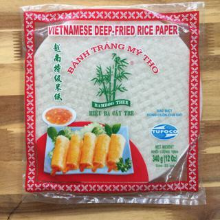

# Vietnamese Spring Rolls
## Materials
### Filling
* Large bowl
* Cheese grater
* Food processor (optional)
### Wrapping
* Medium bowl
* Plates
* Pastry brush (optional)
### Frying
* Deep frying pan or cast iron skillet

## Ingredients
Your best bet for the more *ethnic* ingredients is Saigon Meats and
Vegetables in Chinatown.
### Filling
* 1 lb medium ground pork
* A bag of peeled shrimp (more shrimp makes it sweeter)
* 2 cans of pre-cut crab meat
* 1 pack of bean-thread vermicelli
* 1 pack of sliced dried mushroom
* 3 medium carrots, peeled
* 1 jicama, peeled
* 2 medium white onions, chopped
* 1 tsp salt
* 1 tsp pepper
* 2 garlic cloves, chopped **or** 1 tsp garlic plus
### Wrapping
* 1 pack of Vietnamese deep-fried rice paper (Example shown below)

* 1 tallboy can of room temperature cheap beer
### Frying
* Vegetable oil

## Method
### Filling
1. Fill a large bowl with hot tap water and put the mushrooms in first and
then the vermicelli. Let them sit in the bowl until soft (20-30 minutes).
2. Shred carrots and jicama into medium sized ribbons using your grater.
3. Put shrimp in food processor and pulse until it has a similar consistency
as the ground pork. If you don't have a food processor, slam the flat side of
your knife on the shrimp to flatten it and then chop.
4. Remove vermicelli from hot water and strain. Squeeze the vermicelli to
remove as much water as possible. Do the same with the mushrooms but in a
separate colander.
5. Chop the vermicelli until the strands are less than 1cm long. Chop the
mushrooms into a similar size.
7. Combine the ground pork, shrimp, carrots, jicama, onions, vermicelli, and
mushrooms together in a large bowl.
8. Drain the liquid from the crab meat cans and add the crab meat to the
bowl.
9. Add the salt, pepper, and garlic to the bowl and mix until everything is
thoroughly incorporated.
### Wrapping
1. Pour the can of beer into a bowl.
2. Place one sheet of the rice paper onto a plate and use either your hand or
a pastry brush to wet the side of the rice paper that is facing up with the
beer. Let sit until the rice paper absorbs the beer and softens (~1 minute).
    * To speed up the process, wet multiple plates of rice paper while waiting
    for the rice paper to absorb, then you can do multiple rolls in parallel.
3. Place filling (about the size of your thumb) ~1 cm from the bottom edge of
the rice paper or just far enough that you can lift the edge up without
disturbing the filling.
4. Lift the edge of the rice paper up and fold over the filling. Continue to
roll the rice paper until the edge meets the rice paper face.
5. Fold the sides of the rice paper up against the filling and then into the
middle of the roll.
6. Roll the rest of the rice paper up and place the roll onto a larger plate.
Feel free to stack the rolls but put plastic wrap between the layers so that
the rolls don't stick together.
7. Repeat steps **2 - 6** until the plate is filled or you're out of
filling/rice paper.
### Frying
1. Pour vegetable oil into a frying pan or cast iron skillet until the oil is
about the same height as the roll.
2. Heat the oil on high. The oil is ready when you place a wooden chopstick
in it and the oil bubbles and sizzles around it. Then, lower the heat to
medium.
3. Place rolls in one at a time with a couple inches of distance between each
so that they don't stick together. If they end up sticking together, don't
try to rip them apart because you'll end up ripping the rice paper. Just let
them keep frying together and separate them when they're out of the oil.
4. Once the rolls start to firm up (~5 minutes), flip them over. This is
pretty hard because they usually just flip back. Pretty much just do your
best to fry each side evenly.
5. Remove the rolls from oil when they start taking on a golden brown colour
(2-5 minutes) and place in a metal strainer lined with paper towels.
6. Repeat steps **3 - 6** until you're out of rolls.

If you have a few people working on this, you can start [frying](#frying-2)
in parallel with [wrapping](#wrapping-2) once there are enough rolls, to
further streamline the process.
